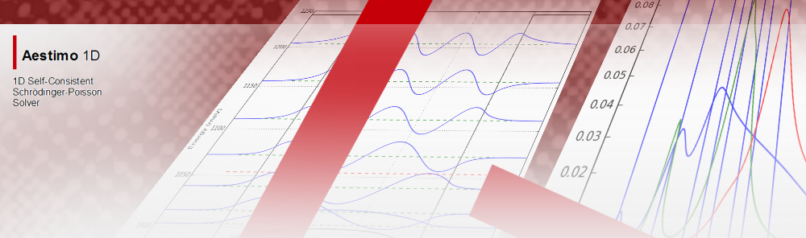

Aestimo is a one-dimensional (1D) self-consistent Schrödinger-Poisson solver for semiconductor heterostructures. Aestimo is started as a hobby at the beginning of 2012, and become an usable tool which can be used as a co-tool in an educational and/or scientific work.

Aestimo is a [GPL](http://www.gnu.org/copyleft/gpl.txt) software, written by many [developers](authors.md). The code is hosted on [Github](https://github.com/aestimosolver/aestimo).

Please,
* Report bugs or [browse opened issues](https://github.com/aestimosolver/aestimo/issues).
* [Browse the code](https://github.com/aestimosolver/aestimo).
* [Contribute!](development.md)
* or socialize with the community using [FB](https://www.facebook.com/aestimosolver).

# Latest Aestimo

Latest stable version of Aestimo is v.1.2 (November 6th, 2017).

Please read [documentation](documentation.md) before downloading or visit [release notes](releasenotes.md) page for more information.

## Cite Information
We will appreciate if any scientific work done using Aestimo v.1.2.0 will contain an acknowledgment and the following reference:

* **R. Steed, H. Hebal, and S. B. Lisesivdin. (2017, November 6). sblisesivdin/aestimo: Version v.1.2 (Version v.1.2.0). Zenodo. http://doi.org/10.5281/zenodo.1042657**

# News

**March 2020**

* Get [masters degree](https://www.lrgresearch.org/vacancies) in Advanced Technologies department @ Gazi University with helping the code development of Aestimo! (10 Mar 2020)
* Project website is now using *just-the-docs* theme. It is more document focused theme. We want to give more importance to documentation in future (10 Mar 2020).

**July 2018**

* [Aestimo 1D version 1.2.1](http://www.aestimosolver.org/releasenotes.html#v121-july-22nd-2018) released. Thanks to Robert Steed. This is a minor release that fixes some issues with using aestimo as a system package in python3 and makes some changes to the intersubband_optical_transitions.py (22 Jul 2018).

**November 2017**

* [Aestimo 1D version 1.2.0](http://www.aestimosolver.org/releasenotes.html#v12-november-6th-2017) released. Thanks to Robert Steed and Hamza Hebal for their efforts to make Aestimo better (06 Nov 2017).

**April 2017**

* Project website https://www.aestimosolver.org is moved to Github.
* Today, we moved all our code and issue management from BitBucket to GitHub. You can find the code at github.com/sblisesivdin/aestimo. Now, with this move, we want to open our code to the large user base of GitHub and expect new committers as many as we can find. This move also makes easier for everyone to contribute to aestimo. Not a single line of code is lost, just moved to another place. This is how we try to make this change for everyone as comfortable as possible (04 Apr 2017).

**November 2016**

* Aestimo has been uploaded to PyPI and can now be installed using a simple `pip install aestimo`. This should also compile the cython extension automatically. You can find it at https://pypi.python.org/pypi/aestimo. Imagine - you can now distribute your aestimo input script and simply tell someone to do `pip install aestimo` before running the script! Particularly since Python is now a popular language for science, this is no longer something esoteric to suggest someone to do. Well, one can dream! (11 Nov 2016)

* [Aestimo 1D version 1.1.0](http://www.aestimosolver.org/releasenotes.html#v11-november-8th-2016) released. Thanks to Robert Steed for this release (08 Nov 2016).

**December 2015**

* We are happy to announce our new domain name http://www.aestimosolver.org/. Old domain http://aestimo.ndct.org will be changed to a forward page in a near future (12 Apr 2015).

**November 2014**

* We have uploaded a new tutorial about modelling the optical absorption of intersubband transitions in quantum wells. There is a module in aestimo specifically for these calculations (intersubband_optical_transitions.py) since the intersubband transitions can be surprisingly shifted from the frequencies of their underlying energy levels due to interactions between the electrons occupying the quantum well. The tutorial is released as an ipython notebook (tutorial4) and can also be found in the tutorials directory of the aestimo package (22 Nov 2014).

**August 2014**

* [Aestimo 1D version 1.0.0](http://www.aestimosolver.org/releasenotes.html#v10-august-29th-2014) released. Aestimo Team is proud to release the version 1.0.0 of Aestimo 1D Self-consistent Schrödinger-Poisson Solver. This version includes many bugfixes, new organization of the structure, wurtzite material using, lots of change in intersubband optical transitions module. Dielectric constants are now handled more accurately. Many tutorials are added in the form of an ipython notebooks. Code is heavily modified and stabilized with more than 60 commits. This version is the most feature rich and stable version so ever  (29 Aug 2014).
* [Aestimo 1D version "elementary"](http://www.aestimosolver.org/releasenotes.html#v10-august-29th-2014) released. This version is easy to understand in terms of coding, and therefore it can be used in undergraduate /graduate courses and forking new solvers. There will be no any other release for the “elementary” version (29 Aug 2014).

**June 2014**

* Developer Robert Steed uploaded a new tutorial about the latest state of aestimo solver and general usage. It includes information about all solvers available, all main files, modelling a structure. It includes many figures and it will answer most of your questions (09 Jun 2014).

**November 2013**

* [Aestimo 1D version 0.9.0](http://www.aestimosolver.org/releasenotes.html#v09-november-10th-2013) released. This version includes many bugfixes, speed improvements, cython code additions, rewritten VBMAT-V part to use numpy better, merging conduction and valance band calculations and more. Code is heavily modified and stabilized (10 Nov 2013).

**July 2013**

* [Aestimo 1D version 0.8.0](http://www.aestimosolver.org/releasenotes.html#v08-july-7th-2013) released. This version includes many new features, bugfixes and small corrections. The most important feature, which is added to Aestimo recently, is the implementation of strain included valence band calculation with 3×3 k.p model. Also, Numpy version is restructured, input file structure and sample inputs are changed and non-parabolicity of conduction band is implemented (Numpy version only). In addition, database is changed to a more clear-understable structure and exchange interaction potential is implemented (Numpy version only). Logging with timers, some customizations in config and a possibility of looping the simulation over a parameter are also the added to new version. Aestimo can work now with new materials InAs, InP, AlP, GaP and new alloys InGaAs, InGaP, AlInP in addition to GaAs and AlGaAs (07 July 2013).

**June 2013**

* Because of the Bitbucket wiki is suffers from lack of features, now we are moving our wiki to a new domain http://aestimo.ndct.org/. The hosting and subdomain is maintained by one of our committer. With the new site, we will be able to include figures and equations in our website, and can make this site usable for all documentation needs. This site will have everything a user need to learn, download and use the aestimo (28 Jun 2013).

**April 2013**

* [Aestimo 1D version 0.7.0](http://www.aestimosolver.org/releasenotes.html#v07-april-27th-2013) released (27 Apr 2013).

**February 2013**

* [Aestimo 1D version 0.6.0](http://www.aestimosolver.org/releasenotes.html#v06-february-2013) released (Feb 2013).

**January 2013**

* [Aestimo 1D version 0.5.0](http://www.aestimosolver.org/releasenotes.html#v05-january-2013) released (Jan2013).

**November 2012**

* [Aestimo 1D version 0.4.0](http://www.aestimosolver.org/releasenotes.html#v04-november-2012) released (Nov 2012).

**October 2012**

* [Aestimo 1D version 0.3.0](http://www.aestimosolver.org/releasenotes.html#v03-october-2012) released (Oct 2012).

**September 2012**

* [Aestimo 1D version 0.2.1](http://www.aestimosolver.org/releasenotes.html#v021-september-2012) released (Sep 2012).

**June 2012**

* [Aestimo 1D version 0.2.0](http://www.aestimosolver.org/releasenotes.html#v02-june-2012) released (Jun 2012).

**March 2012**

* [Aestimo 1D version 0.1.0](http://www.aestimosolver.org/releasenotes.html#v01-march-2012) released (Mar 2012).